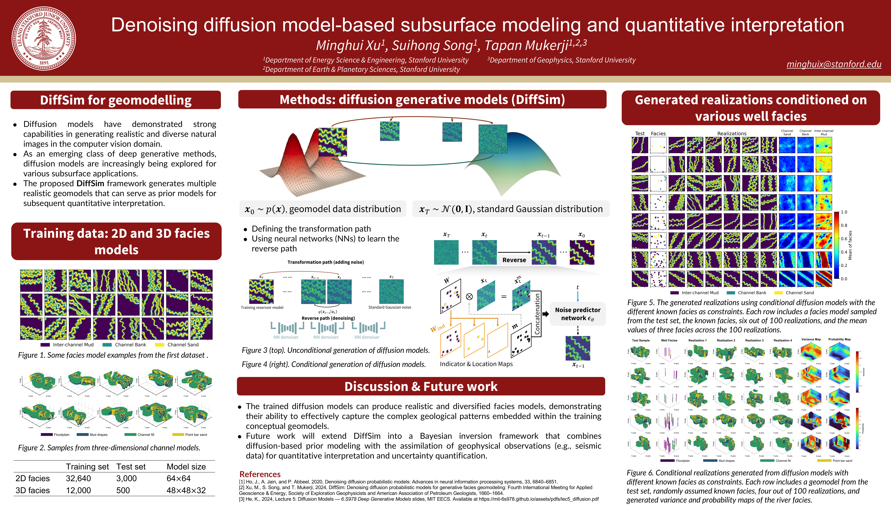

# DiffSim: Diffusion Models for Geomodelling



Unconditional and conditional diffusion models for geological facies modeling.

## Overview

DiffSim provides a unified framework for training and using diffusion models on geological data, supporting:
- **2D facies modeling** (channel facies, mud drapes)
- **3D volumetric modeling** (3D facies)
- **Unconditional generation** (generate new samples from noise)
- **Conditional generation / Inpainting** (fill in missing regions given constraints)

## Cases

| Case | Description | Type |
|------|-------------|------|
| case1_geomodeling | 2D channel facies | 2D |
| case2_muddrape | 2D mud drape facies | 2D |
| case3_la3d | 3D facies modeling | 3D |

## Installation

### Requirements
- Python 3.10+ (tested with 3.12)
- PyTorch 2.0+ with CUDA support (recommended for training)
- CUDA 12.1 (recommended)

### Setup

**Option 1: Using environment.yml (recommended)**
```bash
# Create conda environment from file
conda env create -f environment.yml
conda activate diffsim
```

**Option 2: Manual conda setup**
```bash
# Create a new conda environment
conda create -n diffsim python=3.12
conda activate diffsim

# Install PyTorch with CUDA 12.1 (adjust for your CUDA version, see https://pytorch.org)
conda install pytorch torchvision pytorch-cuda=12.1 -c pytorch -c nvidia

# Install other dependencies
pip install -r requirements.txt
```

**Option 3: Using pip only**
```bash
# Install PyTorch first (with CUDA support)
pip install torch torchvision --index-url https://download.pytorch.org/whl/cu121

# Install other dependencies
pip install -r requirements.txt
```

### Verify Installation

Run the test script to verify everything is working:
```bash
python tests/test_models.py
```

You should see all tests pass:
```
=== Testing Imports ===
  [PASS] diffsim main package
  [PASS] diffusion module
  ...
ALL TESTS PASSED - Installation verified!
```

## Project Structure

```
DiffSim/
├── diffsim/                  # Main package
│   ├── models/               # UNet architectures
│   │   ├── unet.py          # 2D UNet
│   │   ├── unet3d.py        # 3D UNet
│   │   └── guided_diffusion/ # Conditional models
│   ├── core/                 # Core utilities
│   │   ├── diffusion.py     # Beta schedules, sampling
│   │   ├── network.py       # Conditional network wrapper
│   │   └── utils.py         # Utility functions
│   └── data/                 # Dataset classes
│       ├── dataset.py       # 2D and 3D datasets
│       └── mask.py          # Mask generation
├── configs/                  # Configuration files
├── notebooks/                # Jupyter notebooks for inference
├── scripts/                  # Training scripts
└── checkpoints/              # Model checkpoints (gitignored)
```

## Checkpoints

Download pretrained models from [Google Drive](https://drive.google.com/drive/folders/1_qOA0RCEbGVY-hJVpY1xFi5KI2xjGQiq?usp=sharing) and place them in the `checkpoints/` directory.

## Usage

### Quick Start

```python
import torch
from diffsim import Unet, Diffusion

# Create model
model = Unet(dim=64, channels=1, dim_mults=(1, 2, 4))

# Load checkpoint
model.load_state_dict(torch.load('checkpoints/case1_geomodeling/unconditional.pth'))

# Generate samples
diffusion = Diffusion(timesteps=1500, beta_schedule='linear')
samples = diffusion.sample(model, image_size=64, batch_size=16, channels=1)
```

### Training

**Unconditional Training:**
```bash
python scripts/train_unconditional.py --config configs/case1_geomodeling.json
```

**Conditional Training:**
```bash
python scripts/train_conditional.py --config configs/case1_geomodeling.json
```

### Inference

See the notebooks in `notebooks/` for complete inference examples:
- `case1_geomodeling.ipynb` - 2D channel facies
- `case2_muddrape.ipynb` - 2D mud drape facies
- `case3_la3d.ipynb` - 3D facies modeling

## Configuration

Each case has a JSON configuration file in `configs/` with the following structure:

```json
{
  "name": "case1_geomodeling",
  "type": "2d",
  "image_size": 64,
  "unconditional": {
    "timesteps": 1500,
    "channels": 1,
    "dim": 64,
    "dim_mults": [1, 2, 4],
    "beta_schedule": "linear",
    "training": { ... }
  },
  "conditional": {
    "timesteps": 1500,
    "in_channel": 5,
    "out_channel": 1,
    ...
  }
}
```

## Acknowledgments

- [The Annotated Diffusion Model](https://huggingface.co/blog/annotated-diffusion) by Hugging Face
- [Palette: Image-to-Image Diffusion Models](https://github.com/Janspiry/Palette-Image-to-Image-Diffusion-Models) by Janspiry

## License

This project is licensed under the Apache License 2.0 - see the [LICENSE](LICENSE) file for details.

## Citation

If you use this code in your research, please cite:

```bibtex
@misc{diffsim2024,
  title={DiffSim: Diffusion Models for Geomodelling},
  author={Your Name},
  year={2024}
}

@inproceedings{xu2024diffsim,
  title={Denoising diffusion model-based subsurface modeling and quantitative interpretation},
  author={Xu, Minghui and Song, Suihong and Mukerji, Tapan},
  booktitle={Fourth International Meeting for Applied Geoscience \& Energy},
  pages={1660--1664},
  year={2024},
  organization={Society of Exploration Geophysicists and American Association of Petroleum Geologists},
  url={https://pubs.geoscienceworld.org/segeab/proceedings/SEGEAB.43/1/1660/693551}
}
```
